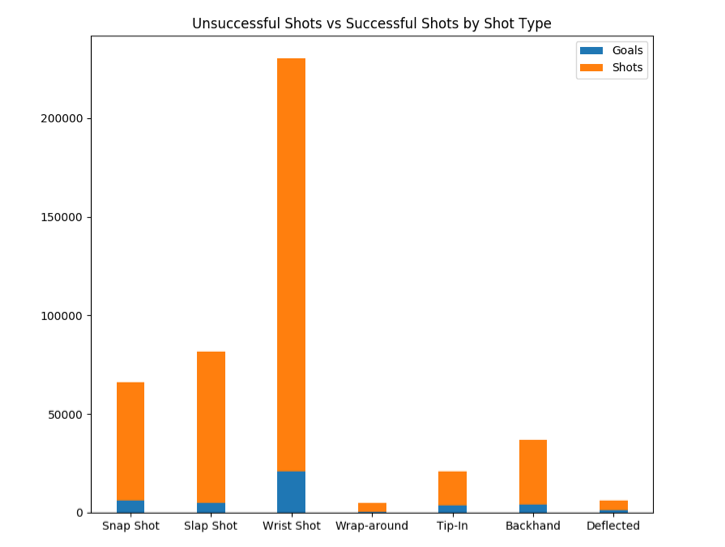
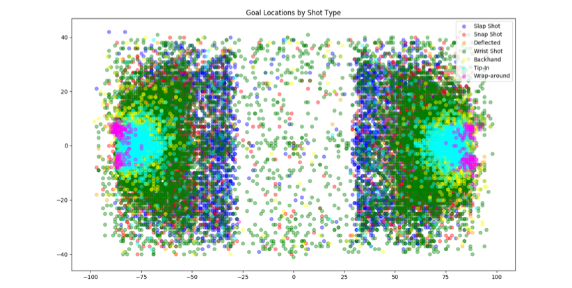
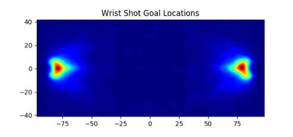
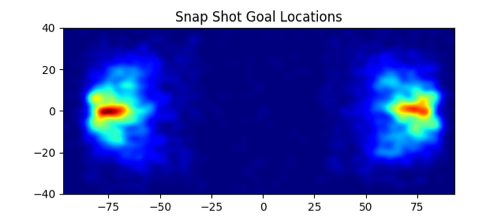
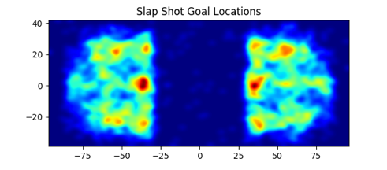
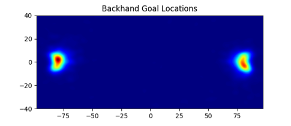

# Data Mining
## Final Project
# Topic:

### Where is the Best Shot Location in the National Hockey League?

## By:

Dallas Brooks  
Jeff Olmstead  
Griffin Storback  

## Introduction

The National Hockey League, NHL, has a vast amount of data on all aspects of the sport. In this report, the best shot location for each type of shot in the NHL will try to be discovered, as well as the efficiency of each. Best will be defined by as the average of the goal locations for each individual shot. Effective will be defined as the sum of goals for a specific shot, divided by the total sum for the same type of shot multiplied by 100%. This will result in the scoring percentage for each specific shot. This information is believed to be useful to know, so that one can utilize this knowledge to try and score more goals and increase their teams' chance of winning. It is believed that the best place to shoot from would be at location 50 X and 0 Y, with a Snap Shot. This is believed because it is a faster release shot than others, with a direct path towards the net, and should generate more goal potential, thus making it the best place to shoot from with the most effective type of shot.

## Data

The data was discovered on Kaggle, the link is in the references. The page the data was found it on is: NHL Game Data, and the subset of data chosen is: Game Plays. This subset of data is 363.81 MB in size. It has more than two million entry points of data. This data has information on when the game is played, who played, the outcome, what events happened and where they took place on the ice. The data does not record a shot if it does not hit the net or is blocked by another player. Therefore, some shots are not recorded and this may adjust the data if they were to be recorded, but for the purpose of this experiment, it can be safely ignored. This data should have more than enough information to try and prove the proposed hypothesis.

## Solution

A linear search is being used to evaluate if a goal has occurred, if it has then the goal count for that specific shot will be incremented. The X and Y location of the goal will then also be added to that qshot's locations average. If there was not a goal, but a shot that had occurred than the not goal count will be incremented for that specific type of shot, and the X and Y locations will be ignored. Once all entries in the data have been viewed, then the result can be reported back to the user, where the type of shot's goal count is then divided by the same type of shot's total count and multiplied by 100%. This is done to get the different type of shots potential effectiveness. The X and Y goal coordinates will then be plotted in a heat map to show where each shot is most common. A linear search algorithm runs in O(n), where n is the amount of data point entries. This implementation of this algorithm runs in less than half of a minute, even on two million points of data. This solution should report the effectiveness of all of the different types of shots recorded in the NHL, as well as where each shot is most effective from.

## Results

It has been discovered that the best place to shoot from is 75 X and 0 Y. In figure 1, the ranking of all the different types of shots can be seen, along with the expected percentage of scoring chance. In figures 3 to 6, the heatmaps for the more common shot types can be seen. It was discovered that effectiveness of each shot is as follows: Slap Shot = 5.898%, Snap Shot = 9.451%, Wrist Shot = 8.994%, Wrap Around = 6.358%, Tip-In = 18.239%, Backhand = 11.387%, and Deflected = 19.877%.

Figure 1: Bar Graph for Shots Effectiveness

Figure 2: Scatter Plot of all Goal Locations

Figure 3: Heat map for Wrist Shot 

Figure 4: Heat map for Snap Shot

Figure 5: Heat map for Slap Shot 

Figure 6: Heat map for Backhand

## Conclusion

In conclusion, a shot from 75 X and 0 Y location is considered to be the best location, as a Deflected shot has the highest scoring chance in this location. This does not confirm the hypothesis, but this is accepted because a Snap Shot and its location is still ranked higher than other shot types. The running time of the implemented algorithm is O(n). The algorithm used should be scalable to look for more attributes. To make the original hypothesis more interesting, best shot location was added. From this project, it was learned that a linear search is the most effective algorithm to perform a task such as this.

## References

Kaggle. (2019). NHL Game Data. [Online]. Available: https://www.kaggle.com/martinellis/nhl-game-data#game_plays.csv

H. Le. (2019). Data Mining - Project Guideline. [Online]. Available: https://hunglvosu.github.io/res/guide-line.pdf

Jurgy. (2017) Generate a Heatmap in MatPlotLib. [Online]. Available: https://stackoverflow.com/questions/2369492/generate-a-heatmap-in-matplotlib-using-a-scatter-data-set
